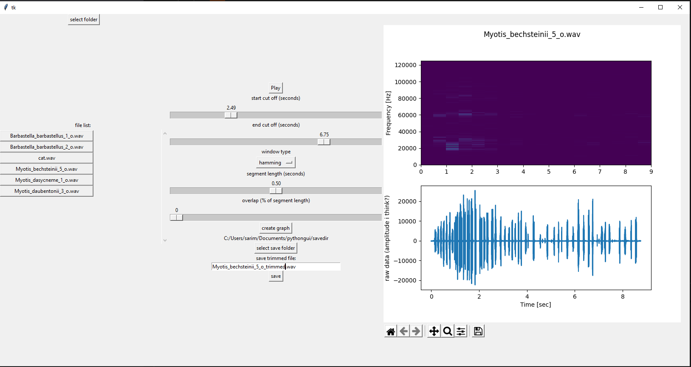

# sound editor for wav files

gui for editing wav files based on their frequencies

Dependencies to install:
- numpy
- scipy
- matplotlib

tkinter (and most gui libraries) uses a heirarchy to reprsesent objects. In order to make my code easier to understand, I've included an image of the heirarchy below

